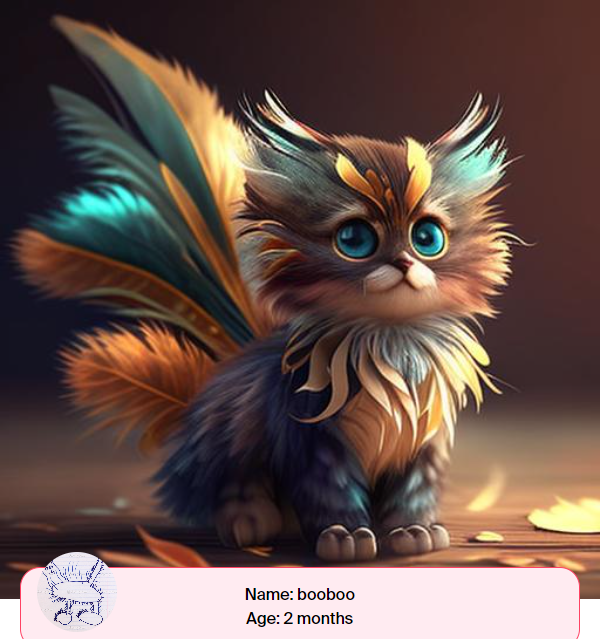
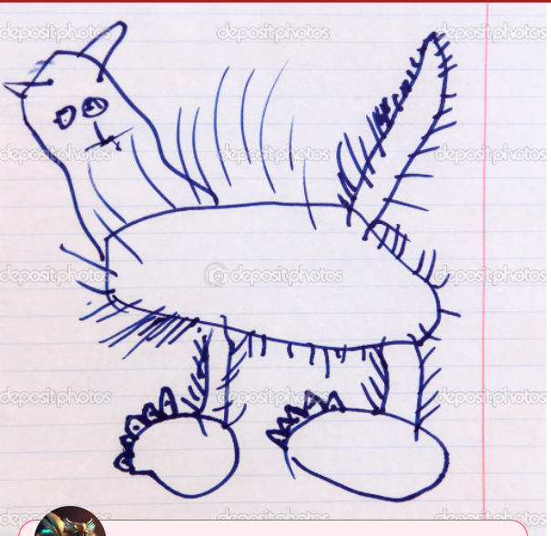
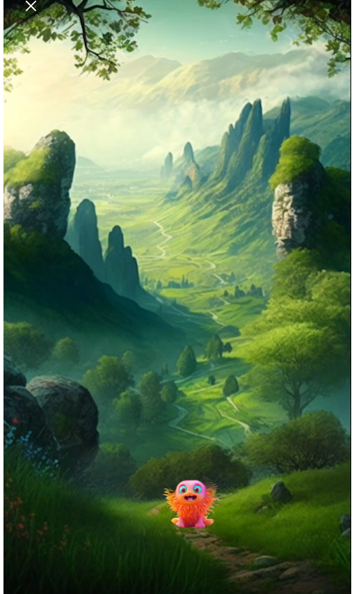

Link
===============

ministudio
https://ministudio.ai/create

ANIMATED DRAWINGS
https://sketch.metademolab.com/

Summary
===============
    This software has the function of transfering a sketch drawing to a real drawing.
    The website asks you to generate your character first with your drawing, then you can
    use the character to generate a story. You can put your character into a story, and
    the drawings on the images as well.
    

Questions and Thoughts Based on little RESEARCH
===============
        This website also tries to sell the product that have kids' drawings or stories as a poster or 
    canvas. 
