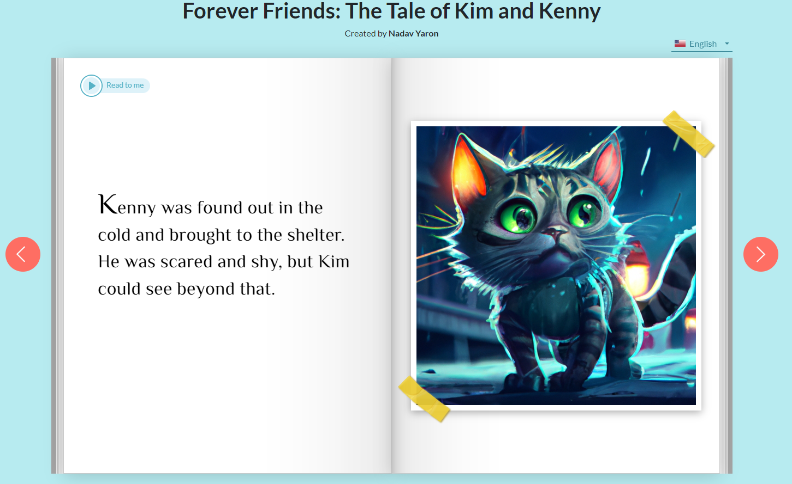

Link
===============

Storywizard.ai
https://www.storywizard.ai/home

Summary
===============
    This software helps to write a story with a single plot line. 
    This software put the whole story into a book. 

Questions and Thoughts Based on little RESEARCH
===============
    1. The software make the whole story a simple structure, easy to read, friendly and beautiful UI.
        Users could change the photos on the right and change the text on the left.
        The generated images are aweful, the text is not good enough. I don't see the point where
        user choose the AI generated story instead of human written story.

Sample Story
===============
    1. https://www.storywizard.ai/s/swexample?h=JDJiJDEyJEZPcTNWZ1FORkpud01TRkk0bUIyYi5aa3g0eGg1L3BQQXZ1aVhVUUM3aVFXMzRvb0VlSlMy
    2. story line: A boy names Monist pees besides a tree, the tree is angry and they have an argument
        Story body: https://www.storywizard.ai/story/1148dc4066/edit