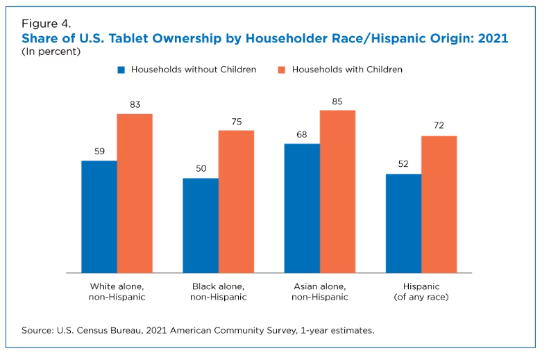

Link
===============

Night Zookeeper
https://www.nightzookeeper.com/

Night Zookeeper Review! How we use it with a 7 & 8 year old.
https://www.youtube.com/watch?v=Kn2j5fgt68k

Night Zookeeper HONEST REVIEW!
https://www.youtube.com/watch?v=dsA2YnbX70E

Summary
===============
        This is a interactive writing and reading software program. Kids can draw their own avatar and make it a character 
    in the story. It provides this functionality to create avatar, art drawing, write stories. Tutors will help 
    rewrite kids' stories or materials. 
        Main selling point should be kids to write their own stories?
    

Questions and Thoughts Based on little RESEARCH
===============
    1. Children in the United States using selected digital and gaming devices in 2020 and 2021

